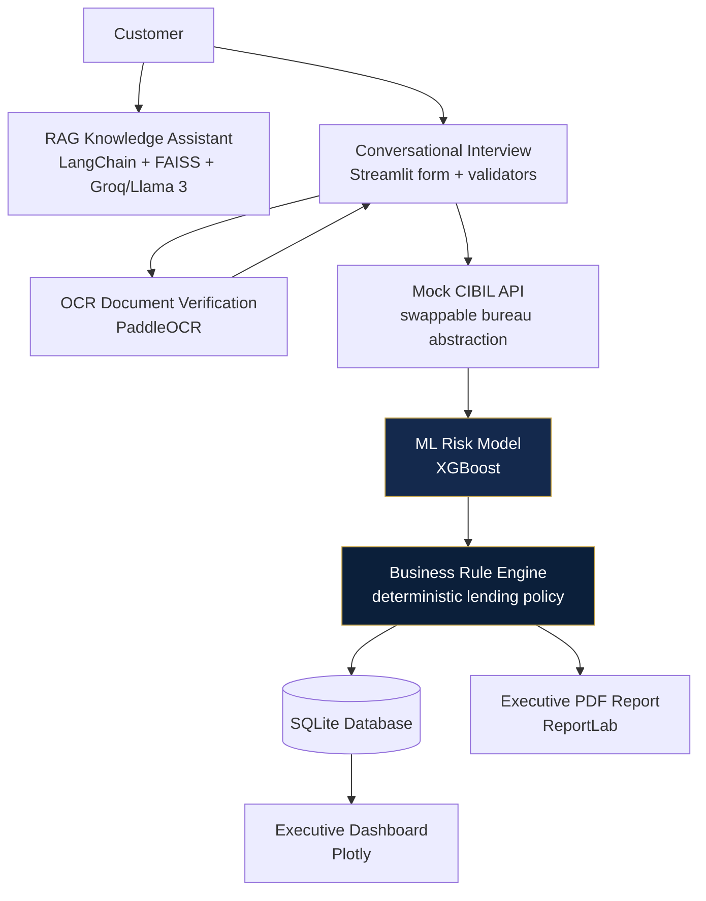

# LoanGuard Enterprise AI — Architecture

## Why the ML model and the rule engine are separate modules

`src/ml/model.py` returns **only** a default probability and a risk
category (`Low` / `Medium` / `High`). It has no concept of "approve" or
"reject". `src/decision/rule_engine.py` is the **only** module in the
codebase that produces a `Decision`. This mirrors how real underwriting
desks work: the model is a signal, the policy engine is the decision-maker.
A regulator or auditor can review `LENDING_RULES` in `config.py` line by
line without needing to understand gradient boosting — that's the whole
point of Explainable AI here.

## Swapping in the real bureau / dataset later

- **CIBIL**: implement a new class satisfying `BureauProvider` in
  `src/api/cibil_api.py` (e.g. `ExperianProvider`), point
  `CIBIL_API_MODE=live` in `.env`. Nothing else changes.
- **Dataset**: replace `data/loan_dataset.csv` with the real Kaggle CSV
  (columns renamed to match `config.ML_FEATURE_COLUMNS` +
  `ML_TARGET_COLUMN`), then re-run `python -m src.ml.train_model`.
